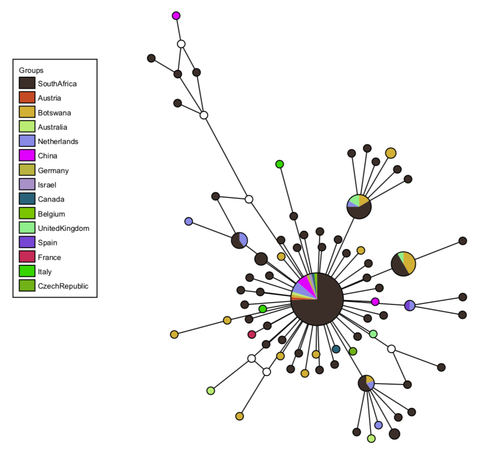

fastHaN
=========================
A fast and scalable program for constructing haplotype network for large-sample sequence data sets. <br>



Description
=========================
* fastHaN is a fast and scalable program for constructing haplotype networks for large samples <br>
* fastHaN can implement the minimum joint network (MJN) and the Templeton-Crandall-Sing (TCS) algorithms <br>
* The implementation in single-thread mode is much faster than the existing softwares <br>
* Furthermore, fastHaN enables multi-threaded mode with good scalability


Quick start guide
========================
    For Linux:
    1. download the software and grant execution permissions
       chmod +x fastHaN_linux

    2. run the test data (Example/Test1000.phy.gz) with mjn algorithm
       ./fastHaN_linux mjn -i Example/Test1000.phy.gz -t 8 -o Test1000

    For windows:
    1. run in the CMD window
        fastHaN_win.exe mjn -i Example/Test1000.phy.gz -t 8 -o Test1000


Usage
========================
    fastHaN [Options]
    
    Options:
        original_tcs        original TCS algorithm (Clement et al., 2000)
        modified_tcs        optimization of TCS implementated by PopART (Leigh, 2015)
        msn                 optimization of MSN implementated by PopART
        mjn                 optimization of MJN implementated by PopART (Bandelt, et al., 1999) 
         

Options
========================

### original_tcs

    usage: fastHaN original_tcs [arguments]

    input:
        -i    input phylip format file
    options:
        -t    (int)thread number(default:8)
        -a    (int)is mark the sites which contains ambiguous base, 1:mask, 0:not(default:0)
        -m    (int)is merge intermediate vertex, 1:merge, 0:not:(default:0)
    output:
        -o    path prefix of the output graph file (GML and json format)
            

### modified_tcs

    usage: fastHaN modified_tcs [arguments]
    
    input:
        -i    input phylip format file
    options:
        -t    (int)thread number(default:8)
    output:
        -o    path prefix of the output graph file (GML and json format)
            
            
### msn

    usage: fastHaN msn [arguments]
         
    input:
        -i    input phylip format file
    options:
        -e    (int)epsilon(default:0)
    output:
        -o    path prefix of the output graph file (GML and json format)
            
            
### mjn

    usage: fastHaN mjn [arguments]
         
    input:
        -i    input phylip format file
    options:
        -t    (int)thread number(default:8)
        -e    (int)epsilon(default:0)
    output:
        -o    path prefix of the output graph file (GML and json format)


Input and Output
========================

### Input file (PHYLIP format)

    3 75
    Hap385899 GATCTGTTCTCTAAACGAACTTGAAAATCTGTGTGGCTGTCACTCGGCTGCATGCTTAGTGCACTCACGCAGTAT
    Hap279195 GATCTGTTCTCTAAACGAACTTTAATATCTGTGTGGCTGTCACTCGGCTGCATGCTTAGTGCACTCACGCAGTAT
    Hap871484 GATCTGTTCTCTAAACGAACTTTAAAATCTGTGTGGCTGTCACTCGGCTGCACGCTTAGTGCACTCACGCAGTAT


* 3: the number of haplotypes
* 75: the number of characters for each haplotype
* Hap385899: the haplotype name
* GATCTG...GTAT: the sequence of the haplotype Hap385899


### Output file (GML and Json format)
Both GML file and Json file represent the constructed haplotype network
* GML file is used as the input of tcsBU software to visualize the haplotye network
* Json file is used to prepare color theme for the constructed haplotype network (refer to section of 'Visualization')


Visualization
========================
After constructing the haplotype network with fastHaN, we need to use the software tcsBU to visualize it.<br>
The tcsBU (https://github.com/sairum/tcsBU) is a browser-based JavaScript program, which is included in fastHaN's package. All you need to do is
unzip tcsBU.zip and double-click the index.html file.<br>
In order to show the composition of haplotypes within one node, you need to provide a META file (two column) that specifies the group information (eg. country, city, et) for each haplotype.<br>


### META file format (given by the user)
there is an example file (Test167.meta) in the directory of 'fastHaN/Visualization/Example'

    Hap6825391      SouthAfrica
    Hap6825397      SouthAfrica
    Hap6825546      Austria
    Hap6795850      SouthAfrica
    Hap6795842      SouthAfrica

* Hap6825391: the haplotype name, which must be consistent with that in the phylip file
* SouthAfrican: the group information of the haplotye Hap6825391


### Generate config files for tcsBU
You can use the Python script of GenNetworkConfig.py to generate two config files required by tcsBU.<br>
You can also manually generate the two config files by referring to the file format below (*_groupconf.csv and *_hapconf.csv)

```python
# generate the config files
python GenNetworkConfig.py Test167.json Test167.meta Test167Conf

# Two config files will be generaged by above command
1. Test167Conf_groupconf.csv
2. Test167Conf_hapconf.csv
```

1\. Test167Conf_groupconf.csv (3 column, semicolon separation)

    SouthAfrica;#4C3D35;none
    Austria;#D56234;none
    Botswana;#DCBD4D;none
  
* 1-th: group name, eg. SouthAfrica
* 2-th: random colors generated by GenNetworkConfig.py, eg. #4C3D35
* 3-th: fixed column with a value of 'none'

2\. Test167Conf_hapconf.csv (2 column, semicolon separation)

    Hap6825390;SouthAfrica
    Hap6825391;SouthAfrica
    Hap6825397;SouthAfrica
    Hap6825546;Austria
    Hap6795850;SouthAfrica
    Hap6795842;SouthAfrica

* 1-th: the haplotype name, which must be consistent with that in the phylip file
* 2-th: group name for each haplotype


Reference
========================
* Bandelt, H.J., Forster, P., and Rohl, A. (1999). Median-joining networks for inferring intraspecific phylogenies. Mol Biol Evol 16, 37-48.
* Clement, M., Posada, D., and Crandall, K.A. (2000). TCS: a computer program to estimate gene genealogies. Mol Ecol 9, 1657-1659.
* Leigh, J.W. (2015). POPART: full-feature software for haplotype network construction. Methods in Ecology and Evolution.
* Murias dos Santos, A., Cabezas, M.P., Tavares, A.I., Xavier, R., and Branco, M. (2016). tcsBU: a tool to extend TCS network layout and visualization. Bioinformatics 32, 627-628.
